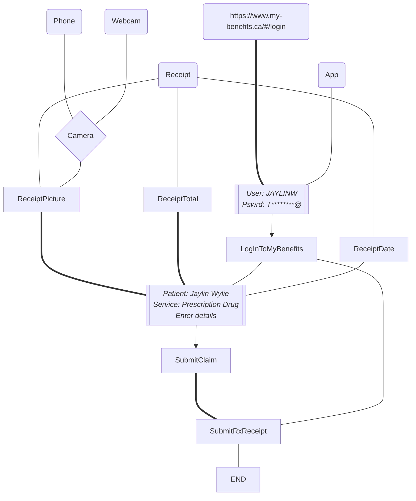

```mermaid
graph TD
LogInToMyBenefitsTasks[["`_User: JAYLINW
Pswrd: T********@_`"]] --> LogInToMyBenefits
https://www.my-benefits.ca/#/login(https://www.my-benefits.ca/#/login) ===== LogInToMyBenefitsTasks
App(App) ---- LogInToMyBenefitsTasks
Camera{Camera}
Phone(Phone) ---- Camera
Webcam(Webcam) ---- Camera
ReceiptPicture[ReceiptPicture]
Receipt(Receipt) ---- ReceiptPicture
Camera --- ReceiptPicture
ReceiptTotal[ReceiptTotal]
Receipt(Receipt) ---- ReceiptTotal
ReceiptDate[ReceiptDate]
Receipt(Receipt) ---- ReceiptDate
SubmitClaimTasks[["`_Patient: Jaylin Wylie
Service: Prescription Drug
Enter details_`"]] --> SubmitClaim
ReceiptPicture ==== SubmitClaimTasks
ReceiptTotal ==== SubmitClaimTasks
LogInToMyBenefits --- SubmitClaimTasks
ReceiptDate --- SubmitClaimTasks
SubmitRxReceipt[SubmitRxReceipt]
SubmitClaim ==== SubmitRxReceipt
LogInToMyBenefits --- SubmitRxReceipt
END[END]
SubmitRxReceipt --- END
```